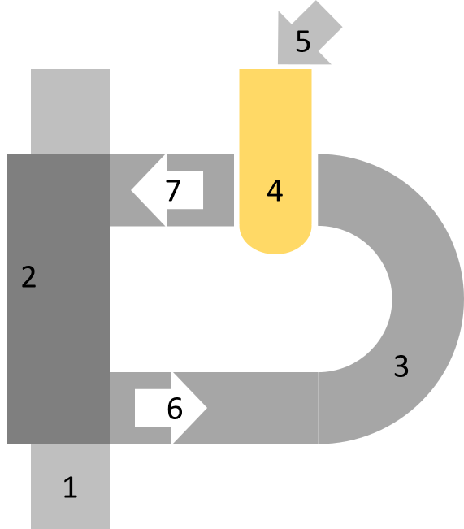

# practical project

*author*

Norman Bauersfeld, Von-Garßen-Str. 12, 38640 Goslar, u37724@hs-harz.de

*about*

practical project within the context of the seminar DaSc (M. Sc) studies

*topics*

water cycle security, mobile target molecule detection, image preprocessing, cluster analysis, regression evaluation

### preamble

main topics to begin with a low budget solution evaluation testing water characteristics

- sustainable water supply
- long-term securing of the water cycle and
- protection of water importance

reasons to ensure supply of clean water

- climate change, pollution, and a growing urban population,
- simple but effective on-site analysis of relevant parameters is required
- identify contaminations
- search for causes
- initiate countermeasures

achievements

- with aim of a project of the development of a simple and inexpensive smartphone-based measurement system for in situ water analysis
- quantitative proof of relevant parameter realization and validation with a simple means and with a reduced need for chemicals (reagences)
- use of a common mobile camera and flash light, in combination with a mount (from the 3D printer and with a functionalized polymer film), should enable qualitative and quantitative detection of the target molecules ($NO_2$, $PH_4$ or $NH_4$)

### review

the following examples will show a small review of sources, given by keyword sequences of

- color metrics of a mobile phone
- image quality of a mobile phone
- microsocope applications with a mobile phone

*examples*

- (Skandarajah, 2014) show, how mobile hardware and vendor software influences image quality and image stability and leads to the necessity to store meta information for every image; it shows an multi-phone holder for a home microscope
- (Hartl, 2010) gives an idea, how to detect image shapes and segments; here in the context of pill recognition in the pharma industry
- (Wu, 2023) adapt image segments in medical applications, hence it may be usable to try to find a smaller method set to find the same results in this practical project
- (Ng, A., 2012) and (Jan et. al., 1988) describe clustering methods, that can be adapted to reduce the color space of an image in an appropriate manner to informational segments of an image (see *ZMeans* and *ZMeansUtils* below)
- implementational aspects to create an adapted Kmeans can be given by the python libraries of (Scypi, 2023) and how to port clustering results of an rgb image into the clustered color space
- a good entry to Kmeans clustering may be (Arthur, 2007)
- (Zach, 2023) shows how the Durbin-Watson-Test can help to evaluate clustering results of an OLS (Ordinary Least Squares) model; OLS models are used to regress concentration detection models
- (Seabold, 2010) is used to regress OLS models to achieve a reagence prediction on site and evaluate model quality and prediction directly by sample data sets; the use of the library secures numerical accuracy and interpretable results
- further to get an idea of application an motivation the need is supported by (Zeit, 2017), (IISA, 2019) or (IFF, 2019)

### *ZMeans* and *ZMeanUtils*

adaption to the well known Kmeans unsupervised clustering, e.g. described in (Arthur, 2007) or (Ng, A., 2012)

regard different color spaces and their conversions (Berriel, 2014)

- bgr; blue-green-red
- rgb; red-green-blue
- lab; luminance; a, b as color-opponent dimensions
- (cixyz and cilab)

re-implemented in _ZMeans.py module to make it evaluable, to describe, adaptable and portable for different target OS (Operating Systems) for on site analysis and for the characteristical images with 3 clusters needed as

- 1st; the black cluster as background
- 2nd and 3rd; the color clusters of the occular color and its shadows (see results in 02.sample)

the implementation includes the steps

- initialisation of Kmeans
- uniformly random center initialisation of the center model vectors by the dataset
- clustering resp. partitioning
- transforming of the image into the data space

special metric implementation further the common metrics of the euclidean space, that can be used in color spaces, where color vectors have a linearity to each other (e.g. the lab color space), where rgb has not

includes a *color* metric that directly clusters rgb image 3d informational data vectors by a rgb > cixyz > cilab (lab) conversion

includes some utilities to

- load bgr images into the rgb and lab color space
- cluster images with the *ZMeans* implementation
- mask images with the cluster results, zoom them to the mask and return color bands and histograms
- further to transform colors into an appropriate color space for visualisation
- includes scoring by partition computation and tests

a place to be with further investigations

- to prepare images with filtering to get better results (sharpen, blur, other filter kernels)
- initialise the centers with other effective methods to get cluster results faster (random, spacial, gath)
- to evaluate color spaces with its metric
- to give an idea of clustering quality to implement different scores of decision
- logging of clustering steps and visualize its trajectories
- how to get faster in clustering by implentational aspects (fortran (F) mode in using of the numpy library, data type conversion to float32 instead of float64, etc.)

### files

[01.data.1](https://htmlpreview.github.io/?https://github.com/nbauersfeld/sma/blob/main/html/01.data.1.html)

- collects raw data from a project folder, that contains time based images and meta data from a mobile
  with a special fiber mount for the analysis of $NO_2$, $NH_4$, $PH_4$ concentrations in a reagence
- to get an idea, how sample images are recorded, a schematic image description supports by
  

1) camera chassis
2) mount to hold
3) the fiber channel and
4) reagence vessel with a given
5) reagent and sample, that is
6) enlighted by cameras flash light and
7) recorded with cameras foto diode

- the raw data folders, containing camera images and meta information are generated by a specific mobile app for analysis purposes developed for this project

[02.sample.1](https://htmlpreview.github.io/?https://github.com/nbauersfeld/sma/blob/main/html/02.sample.1.html)

- samples projects and puts relevant cluster results into project specific data stores
- the main sampling of the images to *mask* information relevant image areas and *cluster* them into informational space
- every concentration folder of a project and reagent holds more than one image per shot inspite of this, only the first image gets evaluated due to light degradation to the other due to the degradation, mobile camera settings has to be fitted or investigated later on
- the light-dark vision concept (partitions in color space) depends on an inequal colored/shadowed spot light, that is given by fiber construction and inequal photo lightning shadowed areas will become equal, if the device is better assembled/connected to the camera light bulb and anaylsis aperture

[03.merge.1](https://htmlpreview.github.io/?https://github.com/nbauersfeld/sma/blob/main/html/03.merge.1.html)

- merges the samples from different data stores into a data container to evaluate in offline mode to prepare the offline models
- every merge depends on the projects available pickle files are only storing cluster results of thte first and 2nd image of a photo shooting per reagence and concentration

[04.evaluate.1](https://htmlpreview.github.io/?https://github.com/nbauersfeld/sma/blob/main/html/04.evaluate.1.html)

- contains first evaluation results of two $NO_2$ projects and a training for a OLS model with test conclusions are given at the end of this file
- the prediction for the given sample is not very good (as expected) to improve the model, more data sets should be recorded
  the tendence of prediction and can be accepted the (bad) prediction quality depends on a model, trained by data of a different working space in conclusion and due to the model, the prediction can be accepted as potential for more training data and further investigations

### conclusion

* ideas of the framework adapted can be found by different sources of publications (see review above)
* a first prototype of the mobile mount or chassis was build with a specific fiber channel
* reagences where selected to identify the target molecules
* an understanding was evolved, how a reagence indicate a concentration of a target and how could it be possible to evaluate them in a color space and how to prepare sample images and where are dependencies of
  * image resolution
  * automatic finding the area of information
  * image filtering
* labeled test and train data was provided by a local water supplier to build models to identify target molecules within an appropriate model in machine learning
* different kinds of models (with a comparable machine learning algorithm) where developed
  * a model to compare and setup data of different target molecules to setup and select the model to predict a concentration of the target
  * a model to compare and predict data of the same target molecule
* the on site data samples where fit with OLS models
* statistical tests where applied to evaluate the results
* a mobile app was developed to store images from the fiber channel aperture by the mobile flash light and camera, evaluate them and extract the actual value of concentration of the prefered target molecules by a pre-defined model on site quickly and interpretable
* sample image collections where transfered to a cloud store or online folder to post train and enhance the models to identify the target molecules
* interation steps where planed to improve models, app handling and mount construction
* field tests where applied to test the first models, mount and mobile app handling

### challenges

* the chassis construction has to be accurate to mount to a mobile of a special type without loss of measurement information
* the fiber channel begin and end has to be plane enough to avoid shadowing or even fringing
* the reagences has to be well prepared in a vessel and easy to handle on site
* a machine learning model (implemented by ZMeans; (Ng, A., 2012) and (Jan et. al., 1988)) has to be appropriate to the evaluation case in the sample color space, furthermore
  * easy to implement for on site analysis and embedded devices
  * fast to execute to give results
  * post trainable and
  * transferable
* a 1st model has to identifiy the target working space
* a 2nd model hast to predict the concentration of the target molecule
* hence: image quality can be improved by choosing an non reduced raw data format to evaluate; that needs more traffic and store and time to proceed analysis
* image quality can be changed by the fiber hardware and experimental mount setup
* the mobile app has always be up to date and understandable in its one page design
* the mobile app can be improved to control the light and image recording manually; actually this is not secured, due to vendor lockings to the camera and light sensor
* the mobile app has pre-trained models to evaluate the the image samples and detect target molecules in an appropriate way just in time and on site (depends on the reagence behaviour)
* the mobile app can restore all on site measurements to an online folder; if the mobile is online and in a special network area, data should be transfered over secure channels
* the transfered samples has to be used to retrain the reagence models to keep the mobile app models up to date;
  evaluation is necessary; whether a preview by an engineer or automatic application is possible
* the inclusion of local water suppliers improve the created results and gives an evaluation by experts (but can be time consuming and annoying)
* common system and user descriptions should be applied to make the mobile app usable and the programming code interpretable
* the OLS models fits to coefficients with the assumption that the residuals are independent to each other; statistical test do not support this actually by showing assumption violations (e.g. Durbin-Watson-Test)

### references

- Arthur, D. & Vassilvitskii, S. (2007), k-means++: the advantages of careful seeding. Proceedings of the Eighteenth Annual ACM-SIAM Symposium on Discrete Algorithms.
- Berriel, R. (2014). OpenCV: Color-spaces and splitting channels. https://rodrigoberriel.com/2014/11/opencv-color-spaces-splitting-channels
- Hartl, A. (2010, May). Computer-vision based pharmaceutical pill recognition on mobile phones. In Proceedings of CESCG 2010: 14th Central European Seminar on Computer Graphics (pp. 51-58).
- Jain, A. K., & Dubes, R. C. (1988). Algorithms for clustering data. Prentice-Hall, Inc.
- Ng, A. (2012). Clustering with the k-means algorithm. Machine Learning, (pp. 1-2).
- SciPy (2023, 08). scipy.cluster.vq.kmeans2. https://docs.scipy.org/doc/scipy/reference/generated/scipy.cluster.vq.kmeans2.html
- Seabold, Skipper, and Josef Perktold (2010). http://conference.scipy.org/proceedings/scipy2010/pdfs/seabold.pdf, Proceedings of the 9th Python in Science Conference.
- Skandarajah, A., Reber, C. D., Switz, N. A., & Fletcher, D. A. (2014). Quantitative imaging with a mobile phone microscope.  PloS one,  *9* (5), e96906.
- Wu, J., Fu, R., Fang, H., Liu, Y., Wang, Z., Xu, Y., ... & Arbel, T. (2023). Medical sam adapter: Adapting segment anything model for medical image segmentation.  arXiv preprint arXiv:2304.12620.
- Zach (2023, August 27). Durbin-Watson-Test. http://www.stratology.org/durbin-watson-test

*links of possible applictions in media (contribution of Prof. Schenkendorf, hs-harz.de)*

- IFF (2019, 07). Presseinformation. https://www.iff.fraunhofer.de/content/dam/iff/de/dokumente/pressemappe/pm20190702-spektralanalysen-mit-smartphone-iq-innovationspreis-mitteldeutschland-fuer-scantechnologie-des-fraunhofer-iff.pdf
- IISA (2019, 07). Spektralanalysen mit dem Smartphone. https://www.investieren-in-sachsen-anhalt.de/presse/nachrichten-iisa/2019/07/spektralanalysen-mit-dem-smartphone
- Zeit (2017, 02). Dies App macht das Smartphone zum Spektrometer. https://www.zeit.de/digital/mobil/2017-02/hawkspex-mobile-app-fraunhofer-institut-gemuese-pestizide-erkennung

### notes

- a first approach description (german) is given by doc/sma_review.pdf, that shows the data understanding, preparation, modelling and evaluation chain; the coresponding quantity/quality report and a schematic view of sample preparation, sample merge and a (small) conclusion
- html prints of the jupyther notebooks are given in the html folder
- raw sample data ist given in the raw folder
- evaluation, training and test data is given in the data folder
- python implementation of *ZMeans* and *ZMeansUtil* are given in the _ZMeans.py script

### statement of orginality

I hereby confirm that I have written the accompanying practical project by myself, without contributions from any sources other than those cited in the text and acknowledgements. This applies also to all graphics, drawings, maps and images included in the thesis.

version 2023-08-31
